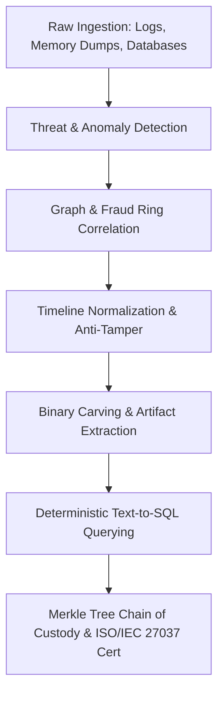

# 🛡️ Digital Forensics & Incident Response Suite (`digital-forensics-suite`)

[](https://github.com/cibi-dev/digital-forensics-suite/actions/workflows/ci.yml)
[](https://python.org)
[](https://github.com/PyCQA/bandit)
[](https://www.iso.org/standard/44381.html)
[](LICENSE)

An enterprise-grade, monorepo digital forensics and incident response (DFIR) suite consolidating **6 high-performance forensic analysis engines** under a single unified CLI, automated triage pipelines, and strict cryptographic chain-of-custody verification.

---

## 🏛️ Suite Architecture

```
+----------------------------------------------------------------------------------------------------+
|                                    Unified CLI (`cli.py` / `forensics`)                             |
+----------------------------------------------------------------------------------------------------+
       |                  |                 |                  |                 |                 |
       v                  v                 v                  v                 v                 v
+--------------+  +---------------+  +--------------+  +---------------+  +---------------+  +--------------+
| 🛡️ threats   |  | 🕸️ network    |  | ⏱️ timeline   |  | 🔬 carver     |  | 💾 sql        |  | 🔒 custody   |
| Threat Log   |  | Crime Network |  | Reconstructor|  | Entropy Carver|  | Text-to-SQL   |  | Merkle Chain |
| Detector     |  | Analyzer      |  | & Timestomp  |  | & Signatures |  | Agent (AST)   |  | ISO/IEC 27037|
| (Isolation   |  | (Louvain &    |  | (Correlation |  | (Shannon Calc |  | (Guardrails & |  | (Blake3/SHA256|
|  Forest ML)  |  |  Fraud Rings) |  |  & Gaps)     |  |  & Extractor) |  |  SQLite)      |  |  HMAC Certs) |
+--------------+  +---------------+  +--------------+  +---------------+  +---------------+  +--------------+
```



---

## 📦 Consolidated Forensic Engines

| Engine | Package Path | Primary Capability | Key Algorithms / Standards |
| :--- | :--- | :--- | :--- |
| **`threats`** | `packages/threat-log-detector` | Unsupervised intrusion & anomaly detection | Isolation Forest, Mahalanobis Distance, Temporal Sliding Windows |
| **`network`** | `packages/crime-network-analyzer` | Criminal cell & money laundering detection | Louvain Modularity, Betweenness/PageRank Centrality, Cycle Detection |
| **`timeline`** | `packages/forensic-timeline-reconstructor` | Multi-source log timeline correlation | Timestomping Detection, Negative Clock Jump Identification |
| **`carver`** | `packages/entropy-file-carver` | Binary signature extraction & analysis | Shannon Entropy, Magic Byte Header/Footer Validation |
| **`sql`** | `packages/text-to-sql-forensic-agent` | Natural language case investigation | AST-Guarded SQL Generation, Parameterized SQLite Engine |
| **`custody`** | `packages/merkle-chain-custody` | Cryptographic evidence verification | Merkle Trees, BLAKE3 / SHA-256, ISO/IEC 27037 HMAC Signing |

---

## 🚀 Quickstart

### 1. Unified Multi-Engine Incident Triage Demo (1 Command)

```bash
# Run local demo
python3 cli.py demo

# Or run via Docker Compose
docker compose up --build
```

### 2. Individual Subcommands

```bash
# Analyze criminal network and detect circular fraud rings
python3 cli.py network find-rings --help

# Correlate logs and detect anti-forensic timestomping
python3 cli.py timeline detect-tamper --help

# Compute Shannon entropy distribution of a suspect binary dump
python3 cli.py carver scan --help

# Cryptographically register evidence into a Merkle Chain of Custody
python3 cli.py custody add --help

# Ingest and query police narrative with AST security guardrails
python3 cli.py sql query --help

# Train and detect intrusions in Linux authentication logs
python3 cli.py threats detect --help
```

---

## 🧪 Testing & DevSecOps Validation

The suite adheres to all **17 canonical DevSecOps standards** (zero hardcoded secrets, AST SQL guards, safe non-pickle deserialization, type safety, and $\ge 90\%$ test coverage).

```bash
# Run entire monorepo integration test suite
pytest tests/ -v

# Run Bandit security audit (Zero High/Medium vulnerabilities)
bandit -r . -ll

# Run Gitleaks secret detection
gitleaks detect --verbose
```

---

## 📄 License & Compliance

- **License:** MIT License
- **Compliance:** ISO/IEC 27037:2012 (*Guidelines for identification, collection, acquisition and preservation of digital evidence*), NIST SP 800-86, OWASP Top 10 for LLM Applications (01/06/10).
