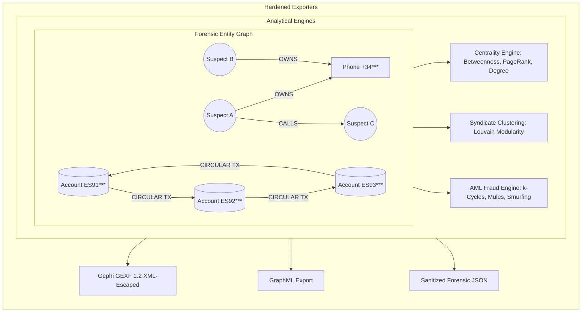

# 🕵️‍♂️ Crime Network Analyzer

[](https://github.com/cibi-dev/crime-network-analyzer/actions)
[](https://github.com/cibi-dev/crime-network-analyzer)
[](https://github.com/PyCQA/bandit)
[](https://github.com/gitleaks/gitleaks)
[](sbom.json)
[](https://www.python.org/)
[](LICENSE)

**`crime-network-analyzer`** is an enterprise-grade Python engine for criminological intelligence, forensic graph analytics, and Anti-Money Laundering (AML) fraud ring detection. It models complex directed and bipartite graphs across heterogeneous criminal entities (suspects, phone lines, bank accounts, IP addresses, companies, locations), computes deterministic centralities, isolates criminal syndicate cells via Louvain modularity, discovers circular carousel fraud loops ($k$-cycles), and exports securely to **GEXF for Gephi**, **GraphML**, and **JSON**.

---

## 🏛️ Criminological Graph Architecture



### Key Capabilities
1. **Heterogeneous Forensic Entity Modeling**: Strict Pydantic v2 validation for entities (`SUSPECT`, `PHONE`, `BANK_ACCOUNT`, `IP_ADDRESS`, `ORGANIZATION`, `LOCATION`, `CRYPTO_WALLET`) and relationships (`TRANSACTION`, `CALL`, `COMMUNICATION`, `LOGIN`, `OWNS`, `ASSOCIATE_WITH`).
2. **Bipartite Projections**: Transforms multi-modal links (e.g. Suspects $\leftrightarrow$ Shared Phones/Accounts) into monopartite co-occurrence forensic networks.
3. **Forensic Centralities**: Identifies Kingpins (high PageRank), Brokers/Couriers (high Betweenness), and Operational Hubs (high Degree connectivity) with composite risk ranking.
4. **Syndicate Cell Isolation**: Deterministic Louvain modularity optimization with inter-community bridge and cross-cell liaison discovery.
5. **AML Fraud Ring & $k$-Cycle Discovery**: Bounded cycle detection for carousel money laundering, pass-through mule account detection (flow ratio symmetry), and smurfing (fan-in aggregation & fan-out dispersion).
6. **Enterprise Visualization Export**: Direct export to Gephi (GEXF 1.2/1.3) with pre-computed node metrics, colors, and edge weights.

---

## ⚡ Quickstart

### 1. Installation

```bash
pip install crime-network-analyzer
```

For development and security tooling:
```bash
pip install -e ".[dev]"
```

---

### 2. Python SDK Usage

```python
from network import (
    CrimeNetworkGraph,
    EntityType,
    RelationType,
    calculate_all_centralities,
    detect_communities_louvain,
    FraudRingDetector,
    export_to_gexf,
)

# 1. Initialize Graph
graph = CrimeNetworkGraph(name="OperationBlackBox")

# 2. Add Entities & Transactions
graph.add_node("SUSPECT_01", entity_type=EntityType.SUSPECT, label="John Doe", risk_score=0.9)
graph.add_node("ACC_A", entity_type=EntityType.BANK_ACCOUNT, label="ES9121000418450200051332")
graph.add_node("ACC_B", entity_type=EntityType.BANK_ACCOUNT, label="ES9121000418450200059999")
graph.add_node("ACC_C", entity_type=EntityType.BANK_ACCOUNT, label="ES9121000418450200058888")

# Circular money laundering transfers
graph.add_edge(("ACC_A", "ACC_B"), relation_type=RelationType.TRANSACTION, amount=50000.0)
graph.add_edge(("ACC_B", "ACC_C"), relation_type=RelationType.TRANSACTION, amount=49500.0)
graph.add_edge(("ACC_C", "ACC_A"), relation_type=RelationType.TRANSACTION, amount=49000.0)

# 3. Compute Centrality Metrics
cent_report = calculate_all_centralities(graph, top_k=3)
print(f"Top Influencers: {cent_report.top_influencers}")

# 4. Detect Criminal Communities
comm_report = detect_communities_louvain(graph)
print(f"Detected Cells: {comm_report.num_communities} (Modularity: {comm_report.modularity})")

# 5. Detect AML Fraud Rings & Mule Accounts
detector = FraudRingDetector(graph)
fraud_report = detector.detect_all(min_cycle_len=3, max_cycle_len=4)
for ring in fraud_report.circular_rings:
    print(f"Found Ring {ring.ring_id}: Path {ring.path} (Total Volume: ${ring.total_amount:,.2f})")

# 6. Export to Gephi GEXF with PII Redaction
export_to_gexf(
    graph,
    filepath="forensic_report.gexf",
    centralities=cent_report,
    communities=comm_report,
    redact_pii=True,  # CWE-209 Protection
)
```

---

### 3. Command-Line Interface (CLI)

`crime-network-analyzer` provides a full-featured CLI:

```bash
# 1. Build graph from CSV or JSON
crime-analyzer build --nodes nodes.csv --edges edges.csv --out network.json

# 2. Run Forensic Analysis (Centralities & Louvain Communities)
crime-analyzer analyze -i network.json --top-k 5 --out analysis.json

# 3. Detect Fraud Rings & Mule Accounts
crime-analyzer find-rings -i network.json --min-len 3 --max-len 6 --out rings.json

# 4. Export to Gephi GEXF with PII Redaction
crime-analyzer export -i network.json -f gexf -o output.gexf --redact-pii

# 5. Execute Performance Benchmark
crime-analyzer benchmark --edges 100000 --out benchmarks/resultados.json
```

---

## 🛡️ DevSecOps & Security Hardening (CWE Mitigations)

This package strictly conforms to the **cibi-dev DevSecOps Security Standard**:

| Security Domain | Standard / Mitigation | Technical Implementation |
|---|---|---|
| **PII Exposure Prevention** | **CWE-209** | Automated redaction (`mask_pii_value`, `redact_pii()`) masking names (`J*** D***`), phone numbers (`[PHONE-***5678]`), IBANs (`ES91****1332`), and IPs (`192.168.*.*`) in reports and visualizations. |
| **XML Injection & XXE Defense** | **CWE-91 / CWE-611** | Strict entity escaping (`&`, `<`, `>`, `"`, `'`) and safe parsing via `defusedxml` in GEXF and GraphML exporters. |
| **Resource Quotas & Anti-DoS** | **CWE-400** | Depth-bounded cycle discovery (`max_length`, `max_cycles`, `threshold`) preventing CPU/memory exhaustion on complete and dense topologies. |
| **Zero Hardcoded Secrets** | **CWE-798** | Automated scanning via Gitleaks in CI; 0 hardcoded secrets. |
| **Path Traversal Protection** | **CWE-22** | Strict path validation and automated directory creation for exports. |
| **Safe Deserialization** | **CWE-502** | Strict schema validation with Pydantic v2. |
| **Supply Chain Integrity** | **CycloneDX** | Automated SBOM generation (`sbom.json`) and `pip-audit --strict` vulnerability scanning. |

---

## 📊 Benchmark & Performance SLA

The package guarantees high-throughput analysis on large-scale forensic datasets:

- **Benchmark Dataset**: Realistic synthetic criminological network with **10,000 nodes** and **100,000 directed edges ($10^5$)** across 50 clustered syndicates.
- **Hardware**: Standard Single-Threaded CPU (No GPU or external database server required).
- **Target SLA**: **< 3.0 seconds**.

### Real Measured Performance (`benchmarks/resultados.json`):
| Phase | Scope | Measured CPU Time |
|---|---|:---:|
| **Ingestion & Validation** | 10,000 nodes, 97,997 edges | `0.2110 s` |
| **Degree & PageRank** | Power iteration ($\text{tol}=10^{-5}$) | `0.1963 s` |
| **Louvain Community Partition** | 50 criminal cells ($\text{Modularity}=0.7771$) | `1.8989 s` |
| **Fraud Ring & Mule Discovery** | $k$-cycles ($k=3, 4$) + pass-through mules | `0.1499 s` |
| **Total Pipeline Time** | **100,000 edges analyzed** | **`2.4573 s` (PASSED)** |

---

## 🧪 Quality & Verification Gates

```bash
# 1. Run full unit & security test suite with coverage
pytest --cov=src/network --cov-report=term-missing --cov-fail-under=90

# 2. Run Static Application Security Testing (SAST)
bandit -r . -ll

# 3. Scan for secret leaks
gitleaks detect --no-git --source . -v

# 4. Generate CycloneDX SBOM
cyclonedx-py environment --pyproject pyproject.toml -o sbom.json
```

---

## 📄 License

MIT License. Designed and maintained by `cibi-dev`.
