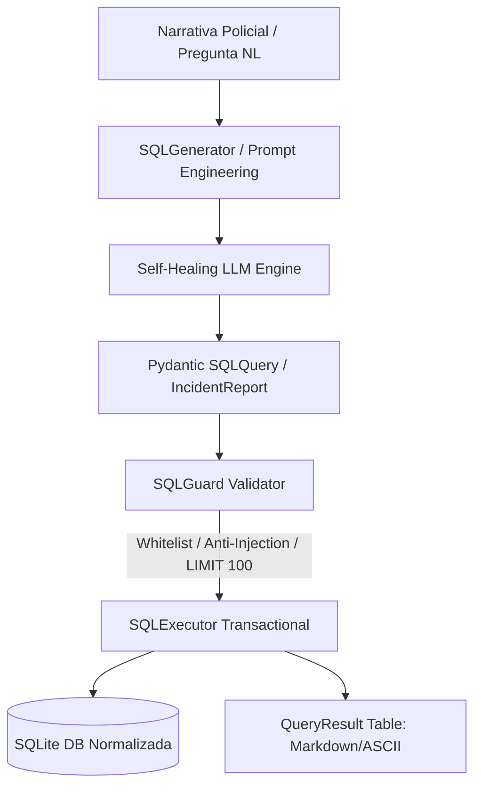

# Text-to-SQL Forensic Agent 🔍⚖️

[](https://www.python.org/downloads/)
[](https://opensource.org/licenses/MIT)
[]()
[](https://docs.pydantic.dev/)
[](https://www.sqlite.org/)

Agente forense en Python puro que procesa narrativas policiales y consultas criminológicas en lenguaje natural, generando consultas SQL parametrizadas (`INSERT` / `SELECT`) con **guardrails de seguridad deterministas**, ejecución transaccional sobre SQLite normalizado y auto-corrección mediante [`guardrails-engine`](https://github.com/cibi-dev/guardrails-engine).

---

## 🏗️ Arquitectura del Sistema



### Flujo de Datos y Seguridad Determinista

1. **Ingesta (`ingest`)**: Narrativa policial libre $\rightarrow$ LLM extrae entidades estructuradas (`IncidentReport`: sospechosos, evidencias, víctimas) $\rightarrow$ Genera sentencias `INSERT` parametrizadas $\rightarrow$ Validación `SQLGuard` $\rightarrow$ Inserción atómica en SQLite con Foreign Keys.
2. **Consulta (`query`)**: Pregunta en lenguaje natural $\rightarrow$ LLM genera consulta `SELECT` parametrizada $\rightarrow$ `SQLGuard` verifica whitelist de tablas, bloquea inyecciones y añade `LIMIT 100` $\rightarrow$ Ejecución en SQLite $\rightarrow$ Formato tabular Markdown/ASCII.

---

## 🚀 Quick-Start

### 1. Instalación
```bash
git clone https://github.com/cibi-dev/text-to-sql-forensic-agent.git
cd text-to-sql-forensic-agent
pip install -e .
```

### 2. Inicializar Base de Datos Forense con Seed
```bash
forensic-sql init-db --db forensic_cases.db --seed
```

### 3. Ingesta de Narrativa Policial
```bash
forensic-sql ingest "En la madrugada del 18 de agosto, un sujeto armado alias 'El Flaco' asaltó una farmacia en Av. Libertador. Se recuperó una vaina servida 9mm." --db forensic_cases.db
```

### 4. Consulta Criminológica en Lenguaje Natural
```bash
forensic-sql query "¿Cuántos sospechosos se encuentran en estado de fuga?" --db forensic_cases.db
```

---

## 🛡️ Matriz de Seguridad y Guardrails (`sql_guard.py`)

| Capacidad / Amenaza | Mecanismo de Defensa Determinista | Resultado |
|---|---|---|
| **Operaciones DDL / DML Destructivas** | Whitelist estricta: únicamente `SELECT` e `INSERT`. Bloqueo de `DROP`, `DELETE`, `UPDATE`, `ALTER`, `ATTACH`, `PRAGMA`, etc. | `SQLSecurityViolationError` |
| **Inyecciones Apiladas / Stacked Queries** | Rechazo estricto de punto y coma (`;`). | `SQLSecurityViolationError` |
| **Evasión mediante Comentarios SQL** | Bloqueo léxico de `--`, `/* */`, `#`. | `SQLSecurityViolationError` |
| **Tautologías e Inyecciones Lógicas** | Detección de patrones `OR 1=1`, `OR TRUE`, funciones de archivo (`load_extension`, `writefile`). | `SQLSecurityViolationError` |
| **Consumo Excesivo / DoS por Volumen** | Inyección y verificación automática de cláusula `LIMIT 100` en todo `SELECT`. | Sanitización / Normalización |
| **Tablas Fuera de Dominio** | Whitelist estricta de tablas: `incidents`, `suspects`, `evidences`, `victims`. Aplicada también a las tablas de origen en `INSERT ... SELECT` y subconsultas. | `SQLSecurityViolationError` |

> ⚠️ **Migración:** el esquema canónico incluye `evidences.evidence_type` y `victims.name_or_identity` / `victims.injury_status`. Las bases creadas con versiones anteriores requieren re-inicialización (`init-db`). La ejecución directa de `SQLQuery.execute(cursor)` fue retirada: toda consulta debe pasar por `SQLExecutor` + `SQLGuard`.

---

## 📊 Esquema Relacional Normalizado

- **`incidents`**: Identificador, tipo de delito, fecha aproximada, ubicación, nivel de riesgo (`Bajo`, `Medio`, `Alto`, `Crítico`), síntesis.
- **`suspects`**: Clave foránea `incident_id`, alias/nombre, rasgos físicos, estado procesal (`Identificado`, `Detenido`, `En fuga`, `Desconocido`).
- **`evidences`**: Clave foránea `incident_id`, elemento recolectado, lugar de hallazgo, tipo de evidencia.
- **`victims`**: Clave foránea `incident_id`, identidad/alias, lesiones, resumen de testimonio.

---

## 🧪 Ejecución de Tests

```bash
pytest -v
```
**Resultado:** 176 tests unitarios y de integración pasando al 100% en <0.5 segundos.
