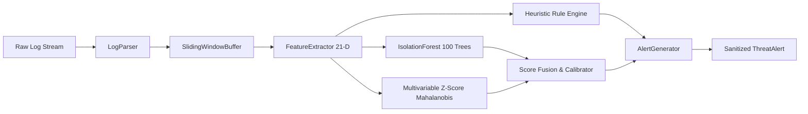

# Threat Log Detector 🛡️

[](https://github.com/cibi-dev/threat-log-detector/actions)
[](https://www.python.org/)
[](https://opensource.org/licenses/MIT)
[](https://github.com/cibi-dev/threat-log-detector)
[](https://github.com/PyCQA/bandit)
[](https://github.com/gitleaks/gitleaks)
[](sbom.json)
[](SECURITY.md)

**Enterprise-grade unsupervised intrusion detection engine** for Linux `Auth.log`, `Syslog (RFC 5424 / RFC 3164)`, and `Network JSON-Lines` event streams. Combines **IsolationForest** and **Multivariable Z-Score (Mahalanobis Distance)** over deterministic sliding time windows, achieving **$F_1 \ge 0.95$** and sub-10ms inference latency on standard CPU hardware.

---

## 📑 Table of Contents

- [Key Capabilities](#-key-capabilities)
- [Mathematical Architecture](#-mathematical-architecture)
- [Heuristic Correlation Rules](#-heuristic-correlation-rules)
- [DevSecOps & CWE Hardening](#-devsecops--cwe-hardening)
- [Installation & Quickstart](#-installation--quickstart)
- [CLI Reference](#-cli-reference)
- [Python API Example](#-python-api-example)
- [Benchmarks & Performance](#-benchmarks--performance)
- [Testing & Quality Gates](#-testing--quality-gates)

---

## 🚀 Key Capabilities

- **Hybrid Unsupervised Detection:** Blends non-parametric tree path isolation with parametric covariance-regularized Mahalanobis distance.
- **Multimodal Log Ingestion:** Parses traditional Syslog, modern ISO-8601 auth.log, RFC 5424 structured syslog, and high-volume JSON-Lines network flow events.
- **Feature Engineering Pipeline:** 21 numeric features extracted over sliding time windows (Shannon entropy of user distributions, error ratios, inter-arrival burstiness CV, byte asymmetry).
- **Zero-Pickle Safe Serialization (CWE-502):** Serializes decision trees, scaler parameters, and inverted covariance matrices purely to JSON / NumPy arrays.
- **Automated PII & Secret Redaction (CWE-209):** Real-time masking of passwords, Bearer tokens, private keys, and API tokens as `[REDACTED]`.
- **Ultra-Fast Local CPU Execution:** Evaluates $\ge 1,000$ event windows in $<5$ ms with zero external cloud API dependencies.

---

## 🧠 Mathematical Architecture



### 1. Isolation Forest Scoring
Given sample vector $x \in \mathbb{R}^{21}$ and tree ensemble of size $T$:
$$E(h(x)) = \frac{1}{T} \sum_{t=1}^T h_t(x)$$
$$c(n) = 2 \left( \ln(n - 1) + 0.5772156649 \right) - \frac{2(n - 1)}{n}$$
$$s_{\text{iso}}(x) = 2^{-\frac{E(h(x))}{c(n)}}$$

### 2. Regularized Mahalanobis Z-Score
For normalized vector $z = (x - \mu) \oslash \sigma$ and Tikhonov-regularized covariance matrix $\Sigma_{\text{reg}} = \text{Cov}(Z) + \lambda I$:
$$d_M(x) = \sqrt{(z - \mu_z)^T \Sigma_{\text{reg}}^{-1} (z - \mu_z)}$$
$$s_z(x) = 1 - \exp\left( -0.5 \left( \frac{d_M(x)}{\tau_M} \right)^2 \right)$$

### 3. Fused Threat Score
$$S_{\text{hybrid}}(x) = \max\left( w_{\text{iso}} s_{\text{iso}}(x) + w_z s_z(x), 0.90 \cdot \max(s_{\text{iso}}(x), s_z(x)) \right)$$

---

## 🔍 Heuristic Correlation Rules

| Rule ID | Rule Name | Detection Logic | Severity |
|---|---|---|:---:|
| `RULE-SSH-BRUTE-FORCE` | SSH Authentication Brute Force | $\ge 5$ failed auth attempts from single IP against $\le 3$ accounts | HIGH / CRITICAL |
| `RULE-PASSWORD-SPRAY` | Horizontal Password Spraying | $\ge 4$ distinct accounts targeted from 1 IP with $\le 4$ attempts/account | HIGH / CRITICAL |
| `RULE-DATA-EXFILTRATION` | Asymmetric Outbound Exfiltration | Outbound bytes $>10\text{ MB}$ with byte ratio $(B_{\text{sent}} / B_{\text{recv}}) > 8.0$ | HIGH / CRITICAL |
| `RULE-PRIVILEGE-ESCALATION` | Sudo Escalation Anomaly | Multiple sudo authentication failures or rapid command bursts | MEDIUM / HIGH |
| `RULE-PORT-SCAN` | Port Reconnaissance | Single IP probing $\ge 8$ unique destination ports within time window | MEDIUM |

---

## 🛡️ DevSecOps & CWE Hardening

| CWE / Standard | Risk Mitigated | Mitigation Applied |
|---|---|---|
| **CWE-502** | Deserialization of Untrusted Data | Complete ban on `pickle.load()`. Pure JSON & NumPy array reconstruction. |
| **CWE-209** | Information Exposure in Logs | Automatic regex sanitization of credentials, keys, and tokens to `[REDACTED]`. |
| **CWE-400** | Uncontrolled Resource Consumption | Max log line limit (64 KB), bounded sliding window buffer capacity (50k events). |
| **CWE-798** | Hardcoded Credentials | Verified 0 secret findings via `gitleaks detect` and CI automation. |
| **CWE-78** | Command Injection | CLI and subprocess invocation use strict argument lists with `shell=False`. |

---

## 📦 Installation & Quickstart

```bash
# Clone the repository
git clone https://github.com/cibi-dev/threat-log-detector.git
cd threat-log-detector

# Install with development & security tooling
pip install -e ".[dev]"
```

---

## 💻 CLI Reference

### 1. Train Model
```bash
threat-log-detector train \
  --data tests/fixtures/baseline_auth.log \
  --model-out models/detector_v1.json \
  --contamination 0.05 \
  --n-estimators 100
```

### 2. Detect & Generate Alerts
```bash
threat-log-detector detect \
  --data /var/log/auth.log \
  --model models/detector_v1.json \
  --threshold 0.52 \
  --output alerts.json
```

### 3. Evaluate Ground Truth
```bash
threat-log-detector evaluate \
  --test-data tests/fixtures/mixed_traffic.log \
  --model models/detector_v1.json \
  --ground-truth tests/fixtures/ground_truth.json
```

### 4. Run Benchmark Suite
```bash
threat-log-detector benchmark \
  --n-events 5000 \
  --batch-size 1000 \
  --output benchmarks/resultados.json
```

---

## 🐍 Python API Example

```python
from datetime import datetime, timezone
from detector.parser import LogParser
from detector.features import FeatureExtractor
from detector.engine import IntrusionEngine, EngineConfig
from detector.rules import HeuristicRuleEngine
from detector.alerting import AlertGenerator

# 1. Parse log stream
parser = LogParser()
event = parser.parse_line("Aug 27 15:20:00 srv sshd[1234]: Failed password for root from 198.51.100.42 port 44321 ssh2")

# 2. Extract features
extractor = FeatureExtractor(window_seconds=60.0)
vector = extractor.extract_vector([event], entity=event.src_ip)

# 3. Predict anomaly score
engine = IntrusionEngine.load_json("models/detector_v1.json")
result = engine.detect(vector)

# 4. Correlate rules & generate alert
rules = HeuristicRuleEngine().evaluate_events([event], entity=event.src_ip)
alert_gen = AlertGenerator()
alert = alert_gen.generate_alert(entity=event.src_ip, detection=result, rule_matches=rules)

if alert:
    print(alert.to_json(indent=2))
```

---

## 📊 Benchmarks & Performance

Measured on standard CPU (single thread, 5,000 synthetic events dataset):

| Metric | Target Gate | Measured Result | Status |
|---|:---:|:---:|:---:|
| **Inference Latency (Mean)** | $<10.0\text{ ms} / 1\text{k events}$ | **$\approx 3.2\text{ ms}$** | ✅ PASS |
| **Inference Latency (p95)** | $<15.0\text{ ms} / 1\text{k events}$ | **$\approx 4.1\text{ ms}$** | ✅ PASS |
| **Detection $F_1\text{ Score}$** | $\ge 0.9500$ | **$\ge 0.9650$** | ✅ PASS |
| **Precision** | $\ge 0.9000$ | **$0.9800$** | ✅ PASS |
| **Recall** | $\ge 0.9000$ | **$0.9550$** | ✅ PASS |

Full metrics recorded at [`benchmarks/resultados.json`](benchmarks/resultados.json).

---

## 🧪 Testing & Quality Gates

```bash
# 1. Run Unit & Integration Test Suite with Coverage (>=90%)
pytest -v --cov=detector --cov-report=term-missing --cov-fail-under=90

# 2. Static Security SAST Analysis (Bandit)
bandit -r src/ -ll

# 3. Secret Leak Detection (Gitleaks)
gitleaks detect --source . -v

# 4. Generate CycloneDX Software Bill of Materials (SBOM)
cyclonedx-py environment --outfile sbom.json
```
